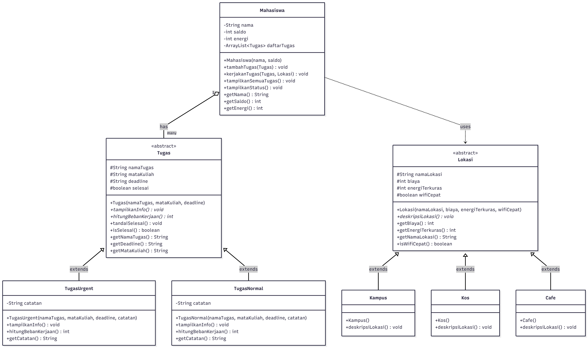

|Nama | Malikha Syarifa Dewi  |
|--|--|
|NRP   |5027251032  
Kelas  |A

Activity 04 - Object-Oriented Programming 

**Deskripsi Kasus**
Sebagai mahasiswa yang merantau dan tinggal di kos, sering menemui masalah yang sepele seperti tidak bisa mnegatur keuangan atau waktu, tugasnya menumpuk, mengerjakan tugas dekat deadline, hingga terkadang terpadat di sutuasi sinyal Wifi kos yang lemot atau jelek. Selayaknya mahasiswa yang sering menghabiskan waktu untuk mengerjakan tugas di cafe atau tempat nongkrong lain yang menyebabkan uang kita cepat habis. 
Karna hal tersebutlah program ini dibuat berdasarakan pengalaman nyata. Program ini dibuat untuk membantu mahasiswa mencatat tugas kuliah, mengkategorikan mana tugas prioritas dan bukan, memilih lokasi untuk mengerjakan tugas, serta membantu mengatur keuangan pada saat mengerjakan tugas diluar seperti di cafe. Selain itu pada program ini dapat mengatur energi kita sehingga dapat mengetahui kapan kita harus istirahat dan kapankita bisa menlanjutkan mengerjakan tugas. 

**Class Diagram**


**Kode Program Java**
Penjelasan Setiap Class 
1.<Tugas>
```java 
abstract class Tugas {
   protected String namaTugas;
   protected String mataKuliah;
   protected String deadline;
   protected boolean selesai;

   public Tugas(String var1, String var2, String var3) {
      this.namaTugas = var1;
      this.mataKuliah = var2;
      this.deadline = var3;
      this.selesai = this.selesai;
   }

   public abstract void tampilkaninfo();

   public abstract int hitungTotalkerjaan();

   public void tandaiSelesai() {
      this.selesai = true;
      System.out.println(" Tugas [" + this.namaTugas + "] selesai!!");
   }

   public boolean isSelesai() {
      return this.selesai;
   }

   public String getNamaTugas() {
      return this.namaTugas;
   }

   public String getDeadline() {
      return this.deadline;
   }

   public String getMatakuliah() {
      return this.mataKuliah;
   }
}
```
<Tugas> abstract class ini yang jadi inti dari semua jenis tugas, menyimpan atribut umum seperti nama tugas, mata kuliah, deadline dan status selesai.

2. <TugasPrioritas>
```java 
class TugasPrioritas extends Tugas {
   private String catatan;

   public TugasPrioritas(String var1, String var2, String var3, String var4) {
      super(var1, var2, var3);
      this.catatan = var4;
   }

   public void tampilkaninfo() {
      String var10001 = this.namaTugas;
      System.out.println("Tugas Prioritas" + var10001);
      var10001 = this.mataKuliah;
      System.out.println("   Mata Kuliah : " + var10001);
      var10001 = this.deadline;
      System.out.println("   Deadline    : " + var10001);
      var10001 = this.catatan;
      System.out.println("   Catatan     : " + var10001);
      System.out.println("   Status      : " + (this.selesai ? "Selesai" : "Belum - SEGERA KERJAKAN!"));
   }

   public int hitungTotalkerjaan() {
      return 3;
   }
   ```
   pada sub class dari tugas ini digunakan untuk tugas yang deadline mepet. metode <hitungBebanKerjaan()> akan mengembalikan nilai 3 (artinya bebannya tingg)

3. <TugasTanggatLama>
```java 
class TugasTanggatLama extends Tugas {
   private String catatan;

   public TugasTanggatLama(String var1, String var2, String var3, String var4) {
      super(var1, var2, var3);
      this.catatan = var4;
   }
```
pada sub class dari tugas ini sama seperti fungsi sub class <TugasPriorita>, namun pada <TugasTanggatLama> ini artinya tugasnya deadlinenya masih lama. metode <hitungBebanKerjaan()> nanti akan mnegembalikan niali 1
4. <Lokasi>
```java
abstract class Lokasi {
   protected String namaLokasi;
   protected int biaya;
   protected int energiTerkuras;
   protected boolean Wifi;
   ```
abstract class ini yang menjadi parent dari semua pilihan lokasi belajar, menyimpan atribut biaya, energi terkuas dan status wifi
5. <Kampus> <Kos> <Cafe>
sub class dari <Lokasi> dengan karakteristik yang beda misal:
- Kos itu tidak ada baiaya tambahan namun, wifi lemot 
6. <Mahasiswa>
```java 
class Mahasiswa {
   private String nama;
   private int saldo;
   private int energi;
   private ArrayList<Tugas> daftarTugas;
```
ini adalah class utama yang menyimpan data mahasiswa dan mengelola daftar tugas. di class ini berisi method untuk menambahkan tugas, mengerjakan tugas, dan menampilkan tugas 


**Prinsip OOP yang Diterapkan**
1. Encapsulation
Semua atribut di class <Mahasiswa> bersifat <private> (nama, saldo, energi, daftarTugas). Data hanya bisa diakses melalui method getter dan method khusus seperti <kerjakanTugas()>. mencegah perubahan data secara langsung dari luar class dan menjaga integritas data.
2. Inheritance
<TugasPrioritas> dan <TugasTanggatLama> menuruni class abstract <Tugas>. <Kampus><Kos><Cafe> inheritance dari class abstract <Lokasi>
3. Polymorphsim 
Method <tampilkaninfo()> pada <TugasPrioritas> menampilkan peringatan "SEGERA KERJAKAN!", sementara <TugasTanggatLama> menampilkan "masih ada waktu" — meskipun dipanggil dengan cara yang sama. Begitu pula method <deskripsiLokasi()> pada tiap subclass <Lokasi> yang menampilkan deskripsi berbeda-beda.
4. Abstraction 
<Tugas> dan <Lokasi> adalah abstract class yang tidak bisa di instansiasu langsung, keduanya mendifiniskan method abstract <tampilaninfo()>, <hitungTotalKerjaan()>, <deskripsilokasi()> yang wajib di implementasikan oleh subclass masing-masing.

**Keunikan Program**
1. program ini membagi tugas menjadi <TugasPrioritas> dan <TugasTanggatLama>. Setiap tipe memiliki pesan status yang berbeda ("SEGERA KERJAKAN!" vs "Masih ada waktu"), yang memberikan efek psikologis nyata bagi pengguna dalam simulasi.
2. Pada program ini terdapat management keuangan untuk nongkrong belajar diluar, dan kita tidak bisa memilih asal karna di setiap pilihanya itu ada konsekuen (Biaya, energi kita untuk keluar, dan kualitas wifi)
